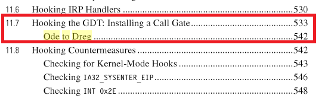

# cgaty 
## version 2022
Hooking the GDT Installing a Call Gate. POC for Rootkit Arsenal Book

Plese, consider make a donation: https://github.com/sponsors/therealdreg

Ode to Dreg chapter By Bill Blunden in the Second edition of the book Rootkit Arsenal:



http://www.amazon.com/The-Rootkit-Arsenal-Evasion-ebook/dp/B007RFXCEW 

> "While I was recovering from writing the first edition of this book, I received an email from David Reguera Garcia (a.k.a Dreg) that included code to deal with the case of multiple processors. To show my appreciation for his effort, I offered to include his proof-of-concept code in the second edition. Thanks David!

> Dreg's work inspired me to write a multiprocessor version of HookGDT. In a nutshell, I recycled the tools I used in the HookSYSTENTER example to modify the GDT assigned to each processor." 

Thx Bill for that words :-)

While I was reading the book (first edition) “The Rootkit Arsenal: Escape and Evasion in the Dark Corners of the System” and I'd like to qualify a few things about the chapter “Hooking the GDT - Installing a Call Gate”. A PoC driver is included at the end of the article that supports WalkGDT for multiple COREs.

A Call Gate is a mechanism in the Intel x86 architecture to change privilege levels of the CPU when running a predefined function that is called by the instruction CALL/JMP FAR.

A call to a Call Gate allows you to obtain higher privileges than the current, for example we can execute a routine in ring0 using a CALL FAR in ring3. A Call Gate is an entry in the GDT (Global Descriptor Table) or LDT (Local Descriptor Table).

Windows doesn't use Call Gate for anything special, but there are malware, as the worm Gurong.A, that installs a Call Gate via DevicePhysicalMemory to execute code on ring0. An article that talks about it is "Playing with Windows/dev/(k)mem" by crazylord and published at Phrack 59.

Nowadays we can't easily access to /Device/PhysicalMemory, I recommend reading the presentation by Alex Ionescu at RECON 2006 "Subverting Windows 2003 SP1 Kernel Integrity Protection". Also, there are examples in the wired that use the API ZwSystemDebugControl to install a Call Gate, but Ionescu's article says that it doesn't work nowadays (although there are techniques to reactivate them).

IMHO, the best way to install a Call Gate is using the driver like the example of the book Rootkit Arsenal, now I'm going to explain the example and I'm going to add some things I see that are missing:
An entry in the GDT looks like this:

```c
typedef struct _SEG_DESCRIPTOR
{
WORD size_00_15;
WORD baseAddress_00_15;
WORD baseAddress_16_23:8;
WORD type:4;
WORD sFlag:1;
WORD dpl:2;
WORD pFlag:1;
WORD size_16_19:4;
WORD notUsed:1;
WORD lFlag:1;
WORD DB:1;
WORD gFlag:1;
WORD baseAddress_24_31:8;
} SEG_DESCRIPTOR, *PSEG_DESCRIPTOR;
```

A Call Gate is an entry type in the GDT which has the following appearance:

```c
typedef struct _CALL_GATE_DESCRIPTOR
{
WORD offset_00_15;
WORD selector;
WORD argCount:5;
WORD zeroes:3;
WORD type:4;
WORD sFlag:1;
WORD dpl:2;
WORD pFlag:1;
WORD offset_16_31;
} CALL_GATE_DESCRIPTOR, *PCALL_GATE_DESCRIPTOR;
```

* offset_00_15: is the bottom of the address of the routine to be executed in ring0, offset_16_31 is the top.
* selector: specifies the code segment with the value KGDT_R0_CODE (0 × 8), the routine will run ring0 privileges.
* argCount: the number of arguments of the routine in DWORDs.
* type: the descriptor type for a 32-bit Call Gate needs the value 0xC
* dpl: minimum privileges that the code must have to call the routine, in this case 0×3, because it will be called by the routine ring3

To create a Call Gate we can follow the following steps:

1. Build the Call Gate that points to our routine.
2. Read the GDTR registry in order to find the GDT using the command: SGDT. The record GDTR has the following appearance:

```c
typedef struct _GDTR
{
WORD nBytes;
DWORD baseAddress;
} GDTR;
```

We can obtain the number of entries in the GDT with GDTR.nBytes/8

1. Find a free entry in the GDT.
2. Write a Call Gate.

To call the Call Gate is only necessary to make a CALL FAR to the GDT selector, ie if we've introduced the Call Gate at the entrance 100 of the GDT, the user space application must execute a CALL FAR 0x320:00000000. 0x320 = 1100100000 = Entry:1100100(GDT) TI=0 RPL=00.. The other part of the FAR CALL is not useful but must be in the instruction.

The Gate Call routine must save the registries: EAX, ECX, EDX, EBX, EBP, ESP, ESI, EDI, EFLAGS and FS. You must also disable interrupts with CLI. FS selector must be 0×30. If you want to return to ring3, it's only necessary to restore the records and activate the interruptions with STI and RETF. I take this from nt!KiDebugService ()

Now is time for a more detailed view, the POC code of the book doesn't allow the possibility of multiple CORES, this means that is only able to install the Call Gate in the CORE assigned when the driver is loaded and the GDT of the oher CORE remains intact, the problem is that if the userspace application makes a FAR CALL being in another CORE where there is no Call Gate, so it doesn't work.

On Windows is easy to control with two APIs: to get the number of COREs you can use:

```c
GetSystemInfo:
void WINAPI GetSystemInfo(
__out LPSYSTEM_INFO lpSystemInfo
);
```

You can use GetLogicalProcessorInformation to configure the number of COREs.
SYSTEM_INFO has the following appearance:

```c
typedef struct _SYSTEM_INFO {
…
DWORD dwNumberOfProcessors;
…
}SYSTEM_INFO;
```

We do a loop with the field dwNumberOfProcessors that executes CORE by CORE by adding the Call Gate, you can also force the driver to install the Call Gate in the first core (1) and the user space application will be executed only in the core 1, this is accomplished using the API: SetThreadAffinityMask, as follows:

```c
DWORD_PTR WINAPI SetThreadAffinityMask(
__in HANDLE hThread,
__in DWORD_PTR dwThreadAffinityMask
);
```

Passing a GetCurrentThread () and the value 1 as AffinityMask,

```c
Affinity = 1;
SetThreadAffinityMask( GetCurrentThread(), Affinity );
```

Be careful, DWORD_PTR is not a pointer to a DWORD, is passed by value.

You can do a loop for the number of processors and the rate variable (the first core is 1 not 0) using Affinity you can install a Call Gate in all the cores. Take notice that it's a mask, so you should use a bit shift like: AffinityMask = 1 << index_variable to scroll through the cores.

I attached a driver as POC where I show all the cores of the GDT, the Call Gate only appears in one CORE.

To do this from a driver is needed:
```c
ZwQuerySystemInformation( SystemBasicInformation, & system_basic_information, sizeof( system_basic_information ), NULL );
```

To obtain the number of cores:
```c
ZwSetInformationThread( (HANDLE) -2, ThreadAffinityMask, & AffinityMask, sizeof( AffinityMask ) );
```

To change the core, -2 is the equivalent to GetCurrent...

Another strange thing of the book's POC is that GDT was passed by value instead the pointer to PrintGDT and this gave me trouble. I've changed to passed as PSEG_DESCRIPTOR and everything ran without errors.

That's all, the code is pretty clear, I hope you understood, greetings from 48bits.

Driver tested in: XP and VISTA (bin driver: WinDDK 6001.17121 & XP x86 Free build).

Some readings about call gates:

* http://www.phrack.com/issues.html?issue=59&id=16
* http://en.wikipedia.org/wiki/Call_gate
* http://www.intel.com/design/processor/manuals/253668.pdf
* http://ricardonarvaja.info/WEB/OTROS/TUTES%20SACCOPHARYNX/
* http://members.fortunecity.com/blackfenix/callgates.html

This is the translation of my spanish post published in blog.48bits.com: http://blog.48bits.com/2010/01/08/rootkit-arsenal-installing-a-call-gate/
